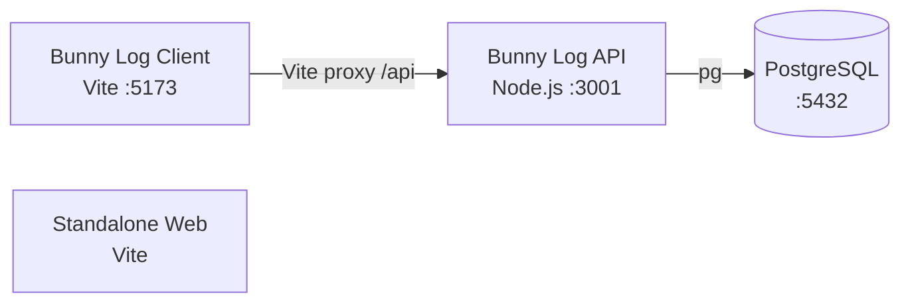

# Azure Debug Plan

> This plan is the source of truth for generating the
> VS Code debug setup in this workspace.
>
> **Status:** Implemented
> **Execution Mode:** Guided
> **Created:** 2026-09-28T17:42:20.5818180+08:00
> **Last Updated:** 2026-09-28T18:25:00+08:00
>
> <!-- Guided Mode (default) - hand-holds the user through review and approval before generating. -->
> <!-- Auto Mode (aka YOLO mode) — skips approval gates and runs generation unattended. -->

---

## Prerequisites

| Tool / Extension | Category | Service(s) | Installed | Version |
|------------------|----------|------------|-----------|---------|
| Node.js | Runtime | client, server, web | ✅ | 24.19.0 |
| npm | Package manager | client, server, web | ✅ | 11.17.0 |
| PostgreSQL | Local database service | server | ❌ | Not installed |
| Chrome | Browser | client, web | ✅ | 154.0.8037.57 |

> ⚠️ **Action required:** Install PostgreSQL locally and create the `bunnylog` database before starting the API or running migrations. Docker is intentionally not required for this debug setup.

---

## Debug Configurations

Each checked service produces a VS Code debug configuration in `.vscode/launch.json`.

| Generate | Debug Config Name | Service Label | Service Root | Project Type | Runtime | Version | Azure Dependencies |
|----------|--------------------|---------------|--------------|--------------|---------|---------|---------------------|
| [x] | Bunny Log API (debug) | Bunny Log API | ./server | app-service | node-ts | 24.19.0 | Local PostgreSQL |
| [x] | Bunny Log Client (debug) | Bunny Log Client | ./client | frontend-spa | node-ts | 24.19.0 | — |
| [x] | Standalone Web (debug) | Standalone Web | ./services/web | frontend-spa | node-ts | 24.19.0 | — |
| [x] | Debug All Services | All Services | — | *Compound Config* | — | — | Local PostgreSQL |

Project Type Descriptions

| Project Type | Description |
|-------------|-------------|
| app-service | Node.js HTTP API application. |
| frontend-spa | Single-page React application served by Vite. |
| *Compound Config* | Starts the API and both frontend debug configurations together. |

> ℹ️ **Proxy detected:** `./client` proxies `/api` requests to the Bunny Log API at `http://localhost:3001`; the compound configuration should start the API before this frontend. `./services/web` has no backend proxy configured.

---

## Local Database

| Service | Host | Port | Database |
|---------|------|------|----------|
| PostgreSQL | `localhost` | `5432` | `bunnylog` |

---

## Architecture Diagram

The client SPA sends `/api` requests through its Vite proxy to the Node.js API, which connects to a locally installed PostgreSQL service; the standalone web SPA has no configured backend connection.

> The project plan and `.env.example` mention Blob Storage, but the current API has no Azure Storage SDK or storage connection usage and saves uploaded image bytes in PostgreSQL. No Azurite emulator is included until Blob Storage is wired into the application.

---

## Migrations

When selected, the generation phase creates a VS Code task to apply database migrations before debugging.

| Generate | Service | Migration Tool |
|----------|---------|----------------|
| [x] | Bunny Log API | Knex |

---

## API Test Collections

When selected, the generation phase creates runnable smoke tests for these HTTP endpoints.

| Generate | Service | Description |
|----------|---------|-------------|
| [x] | Bunny Log API | 

HTTP Endpoints (14)
 GET /api/health GET /api/rabbits POST /api/rabbits GET /api/daily-logs POST /api/daily-logs GET /api/food-entries POST /api/food-entries GET /api/weight-measurements POST /api/weight-measurements GET /api/health-records POST /api/health-records GET /api/memories GET /api/memories/:id/content POST /api/memories/upload 
 |

---

## Convenience Scripts

| Generate | Script | Registered In | Description |
|----------|--------|---------------|-------------|
| [ ] | emulators:start | ./package.json | Not applicable without a container emulator. |
| [ ] | emulators:stop | ./package.json | Not applicable without a container emulator. |
| [ ] | emulators:clean | ./package.json | Not applicable without a container emulator. |
| [x] | db:migrate | ./package.json | Apply the server's existing Knex migrations to the local PostgreSQL database. |

## Debug Configuration Checklist

Debug Configuration Checklist:
✅ Bunny Log Client (debug) — Vite ready signal observed; `http://localhost:5173` returned 200.
✅ Standalone Web (debug) — Vite ready signal observed; `http://localhost:5174` returned 200.
❌ Bunny Log API (debug) — API ready signal and Node inspector on 9229 observed; `/api/health` returned 503 and migrations returned `ECONNREFUSED` because PostgreSQL is not installed locally.
❌ Debug All Services — frontend services started once and returned 200; API started once but could not pass database-backed health validation for the same missing PostgreSQL prerequisite.